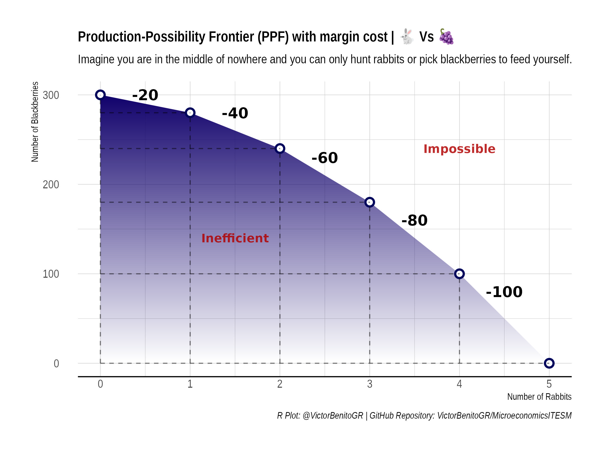

# MicroeconomicsITESM
I will post here anything relevant I've done in my Microeconomics class at Tecnologico de Monterrey.

## Production-Possibility Frontier (PPF) with margin cost
This illustrates the maximum possible output combinations of two goods or services an economy can achieve, given its resources and technology. It represents the trade-off between producing one good over another, showing the opportunity cost of choosing one option over the other.

The concept of marginal cost comes into play when analyzing the PPF. Marginal cost refers to the additional cost incurred by producing one more unit of a good. As an economy moves along the PPF to produce more of one good, the marginal cost typically increases. This is because resources are often specialized, and allocating more resources to a particular good means diverting them from another, causing a decrease in efficiency and an increase in cost.

### Example (ppf_marginal_cost.R):
Imagine you are in the middle of nowhere and you can only hunt rabbits or pick blackberries to feed yourself.

| Rabbits | Blackberries |
|---------|--------------|
| 5       | 0            |
| 4       | 100          |
| 3       | 180          |
| 2       | 240          |
| 1       | 280          |
| 0       | 300          |

